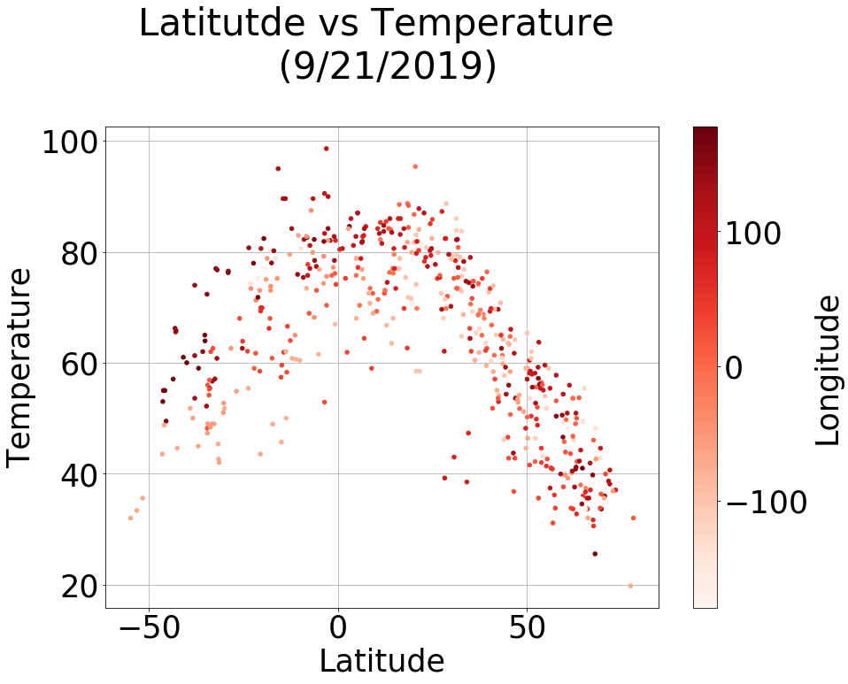
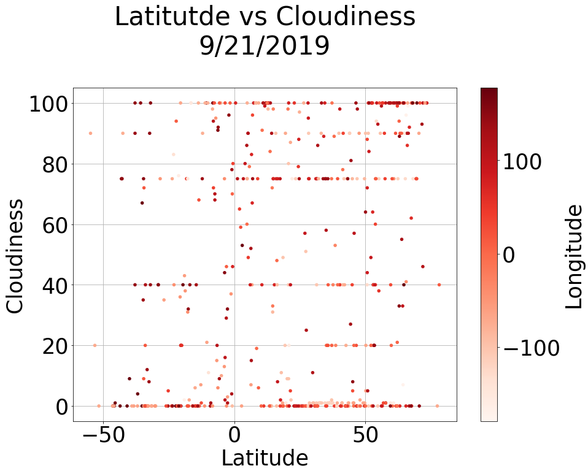
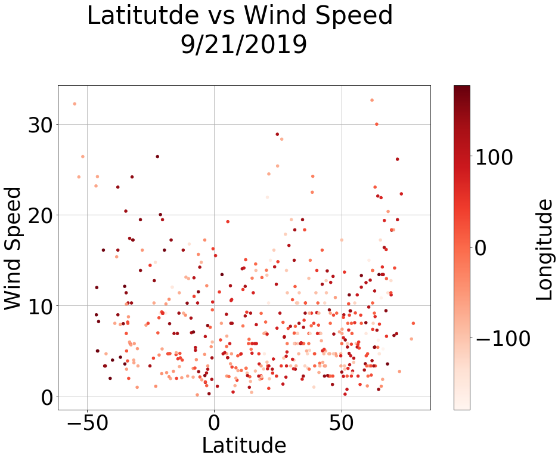
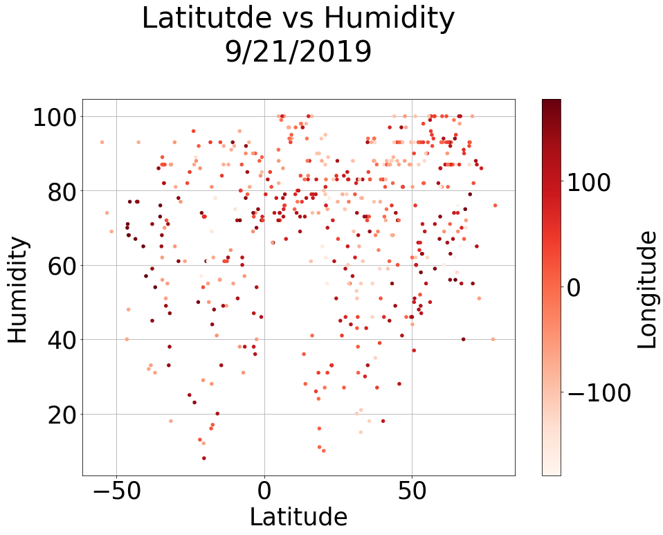

# Weather vs Latitude

## Motivation

The purpose of this project was to analyze how weather changes as you get closer to the equator. To accomplish this analysis, we first pulled data from the OpenWeatherMap API to assemble a dataset on over 500 cities.

After assembling the dataset, I used Matplotlib to plot various aspects of the weather vs. latitude. Factors we looked at included: temperature, cloudiness, wind speed, and humidity. This site provides the source data and visualizations created as part of the analysis, as well as explanations and descriptions of any trends or correlations found in the data.

## Data

The data set was created using the [OpenWeather API](https://openweathermap.org/api) and Python. I created a set of randomly-generated latitude and longitude combinations, then used citipy to identify the nearest city for each coordinate. The script then performs API calls for each coordinate to get the city name and most recent temperature, humidity, cloudiness, and wind speed.

## Plotting

The plotting script uses Matplotlib to create scatter plots comparing each of these weather indicators against the latitude of each coordinate.

